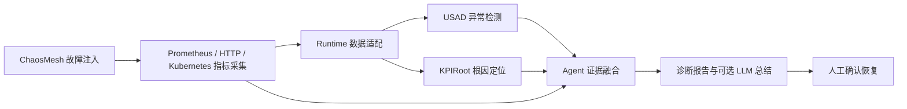

# Online Boutique 端到端 AIOps 智能运维项目

本项目是《软件测试与维护》（2026 年春）课程大作业的完整实现。项目以 Google Online Boutique 为实验对象，完成了微服务部署与监控、ChaosMesh 故障注入、Selenium/JMeter 黑盒测试、USAD 异常检测复现、KPIRoot 根因定位复现，以及端到端实时 AIOps 控制台集成。

项目主线不是展示离线结果文件，而是针对当前故障重新采集 Prometheus 指标，生成算法输入，真实执行 USAD 与 KPIRoot，再由 Agent 综合 Kubernetes、Prometheus 和算法证据生成诊断报告。恢复操作默认保持 dry-run，需要人工确认。

## 系统流程



## 主要完成内容

| 模块 | 完成内容 | 代表结果 |
|---|---|---|
| 微服务环境 | Minikube 部署 Online Boutique，接入 Prometheus、Grafana 和 ChaosMesh | 核心服务正常运行并可注入故障 |
| USAD | 多变量时间序列异常检测、真实 PodChaos-KPI 闭环 | 120 个采样点、16 项 KPI；Precision 0.4643、Recall 0.7429、F1 0.5714 |
| KPIRoot | 三组故障场景的根因 KPI/服务排序及消融实验 | 三组已验证场景的真实根因服务均排名 Top-1 |
| JMeter | 10/30/50 并发矩阵测试 | 错误率均为 0%；平均响应时间 40.20 / 180.22 / 404.30 ms |
| Selenium | 核心购物路径与 Edge 兼容性测试 | 首页、商品页、购物车均通过 |
| 自研微服务 | anomaly-detector 与 online-boutique-probe-exporter | 算法服务化与应用层指标采集 |
| AIOps | 实时采集、USAD/KPIRoot 编排、Agent 诊断、可选 Ark LLM | paymentservice CPU Stress 端到端流程已完整验证 |

## 仓库结构

```text
.
├─ aiops_agent/                         # 实时 AIOps 控制台、Agent、工具与运行证据
├─ external_projects/
│  ├─ usad_anomaly_detection/           # USAD 复现、测试补强与两个自研微服务
│  └─ kpiroot_fault_diagnosis/          # KPIRoot 复现、三组故障与消融实验
└─ docs/
   ├─ report/                           # 五人联合大作业报告
   ├─ presentation/                     # 最终答辩 PPT
   ├─ handoff/                          # AIOps 项目交接说明
   └─ EVIDENCE_INDEX.md                 # 关键实验结果索引
```

## 快速查看

- [五人联合大作业报告（PDF）](docs/report/软件测试与维护大作业报告_五人联合版.pdf)
- [五人联合大作业报告（DOCX）](docs/report/软件测试与维护大作业报告_五人联合版.docx)
- [最终答辩 PPT](docs/presentation/软件测试与维护大作业_最终答辩.pptx)
- [AIOps 项目交接说明](docs/handoff/AIOps项目交接说明.docx)
- [实验结果与证据索引](docs/EVIDENCE_INDEX.md)

## 运行方式

### 1. USAD 基础复现

```powershell
cd external_projects/usad_anomaly_detection
pip install -r requirements.txt
python src/run_usad.py --input data/sample_kpi_metrics.csv --out outputs
```

真实 ChaosMesh-KPI-USAD 闭环：

```powershell
powershell -File scripts/run_chaosmesh_kpi_usad.ps1
```

### 2. JMeter 并发矩阵

设置 `JMETER_HOME` 后运行：

```powershell
cd external_projects/usad_anomaly_detection
powershell -File tests/jmeter/run_jmeter_matrix.ps1
```

### 3. Selenium 多浏览器测试

```powershell
cd external_projects/usad_anomaly_detection
pip install -r tests/selenium/requirements.txt
powershell -File tests/selenium/run_selenium_matrix.ps1
```

### 4. KPIRoot 复现

```powershell
cd external_projects/kpiroot_fault_diagnosis
pip install -r requirements.txt
$env:PYTHONPATH="$PWD/src"
python -m kpiroot.cli `
  --phase2-dir data/phase2 `
  --output-dir data/phase4/kpiroot `
  --report docs/PHASE4_KPIROOT.md
```

### 5. AIOps Dashboard

在仓库根目录运行：

```powershell
pip install -r aiops_agent/requirements-dashboard.txt
streamlit run aiops_agent/dashboard_app.py
```

端到端实时诊断：

```powershell
python aiops_agent/realtime_pipeline_agent.py `
  --config aiops_agent/config.json `
  --duration-minutes 5 `
  --step-seconds 15 `
  --execute-external `
  --usad-epochs 1 `
  --usad-window 5 `
  --usad-train-ratio 0.7 `
  --kpiroot-scenario realtime-paymentservice-cpu `
  --kpiroot-alarm paymentservice
```

需要 Ark LLM 总结时，通过环境变量设置 `ARK_API_KEY` 和 `ARK_MODEL`。仓库中不保存任何真实 API Key。

## 演示主线

1. 在 Dashboard 的“实时故障实验”中选择 `paymentservice` CPU Stress。
2. 使用 ChaosMesh 注入故障，等待 Prometheus 采集实时指标。
3. 在“端到端 AIOps 诊断”中执行 USAD 与 KPIRoot。
4. 在“结果与报告中心”查看异常检测、根因定位和 Agent 诊断。
5. 清理故障。恢复命令仅生成建议，不自动执行。

## 小组分工

| 成员 | 学号 | 主要工作 |
|---|---|---|
| 李响 | 2311467 | USAD 主体复现、Online Boutique 部署与监控、自研微服务 |
| 陈祖名 | 2313163 | ChaosMesh-USAD 真实闭环、JMeter 并发矩阵、Edge 兼容性测试 |
| 王新杰 | 2311901 | KPIRoot 复现、监控采集、故障数据与主实验 |
| 王子祺 | 2312385 | KPIRoot 方案讨论、结果校核与材料整理 |
| 王鼎 | 2213002 | AIOps 控制台、实时流水线、Agent/LLM 集成与安全机制 |

## 安全边界

- ChaosMesh 故障注入、Prometheus 采集、USAD、KPIRoot 和报告生成可真实执行。
- `rollout restart`、扩缩容和删除 Pod 等恢复操作默认不自动执行。
- API Key 只从环境变量或当前 Streamlit 会话读取。
- `runtime_outputs` 与论文复现项目原始输出相互隔离。
